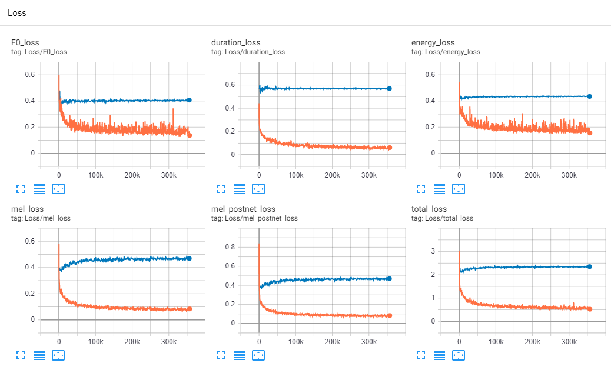
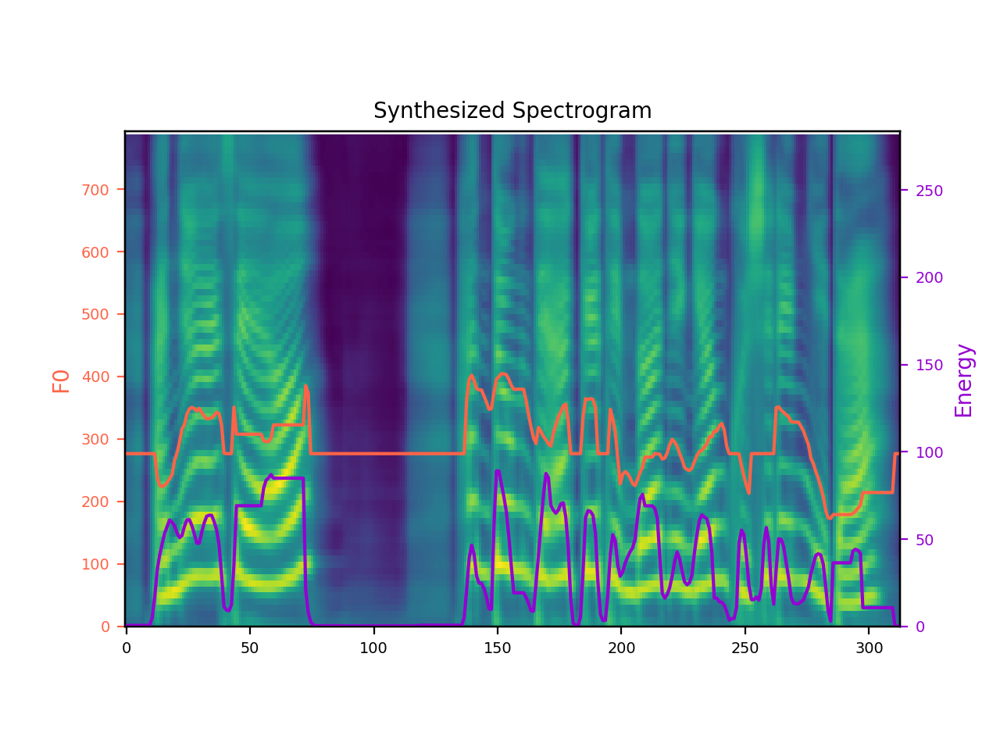

# Korean FastSpeech 2 - Pytorch Implementation (WIP)


# Introduction

최근 딥러닝 기반 음성합성 기술이 발전하며, 자기회귀적 모델의 느린 음성 합성 속도를 개선하기 위해 비자기회귀적 음성합성 모델이 제안되었습니다. FastSpeech2는 비자기회귀적 음성합성 모델들 중 하나로, Montreal Forced Aligner(M. McAuliffe et.al., 2017)에서 phoneme(text)-utterance alignment를 추출한 duration 정보를 학습하고, 이를 바탕으로 phoneme별 duration을 예측합니다. 예측된 duration을 바탕으로 phoneme-utterance alignment가 결정되고 이를 바탕으로 phoneme에 대응되는 음성이 생성됩니다. 그러므로, FastSpeech2를 학습시키기 위해서는 MFA에서 학습된 phoneme-utterance alignment 정보가 필요합니다.

이 프로젝트는 Microsoft의 [**FastSpeech 2(Y. Ren et. al., 2020)**](https://arxiv.org/abs/2006.04558)를 [**Korean Single Speech dataset (이하 KSS dataset)**](https://www.kaggle.com/bryanpark/korean-single-speaker-speech-dataset)에서 동작하도록 구현한 것입니다. 본 소스코드는 ming024님의 [FastSpeech2](https://github.com/ming024/FastSpeech2) 코드를 기반으로 하였고, [Montreal Forced Aligner](https://github.com/MontrealCorpusTools/Montreal-Forced-Aligner)를 이용하여 duration 을 추출해 구현되었습니다.

본 프로젝트에서는 아래와 같은 contribution을 제공합니다.
* kss dataset에 대해 동작하게 만든 소스코드
* Montreal Forced Aligner로부터 추출한 kss dataset의 text-utterance duration 정보 (TextGrid)
* kss dataset에 대해 학습한 pretrained model
    
**FastSpeech2가 생성한 오디오 sample은 [여기](https://soundcloud.com/7vwcti7og4fp/korean-fastspeech2-audio-samples)에서 들으실 수 있습니다.**

# Install Dependencies

먼저 python=3.7, [pytorch](https://pytorch.org/)=1.6, [ffmpeg](https://ffmpeg.org/)와 [g2pk](https://github.com/Kyubyong/g2pK)를 설치합니다.
```
# ffmpeg install
sudo apt-get install ffmpeg

# [WARNING] g2pk를 설치하시기 전에, g2pk github을 참조하셔서 g2pk의 dependency를 설치하시고 g2pk를 설치하시기 바랍니다.
pip install g2pk
```

다음으로, 필요한 모듈을 pip를 이용하여 설치합니다.
```
pip install -r requirements.txt
```

**[WARNING] anaconda 가상환경을 사용하시는 것을 권장드립니다.**


# Preprocessing

**(1) kss dataset download**
* [Korean-Single-Speech dataset](https://www.kaggle.com/bryanpark/korean-single-speaker-speech-dataset): 12,853개(약 12시간)의 샘플로 구성된 한국어 여성 단일화자 발화 dataset입니다.

dataset을 다운로드 하신 후, 압축을 해제하시고 ``hparams.py``에 있는 ``data_path``에 다운받은 kss dataset의 경로를 기록해주세요.

**(2) phoneme-utterance sequence간 alignment 정보 download**

* KSS ver.1.3. ([download](https://drive.google.com/file/d/1bq4DzgzuxY2uo6D_Ri_hd53KLnmU-mdI/view?usp=sharing))
* KSS ver.1.4. ([download](https://drive.google.com/file/d/1LgZPfWAvPcdOpGBSncvMgv54rGIf1y-H/view?usp=sharing))

FastSpeech2를 학습하기 위해서는 [Montreal Forced Aligner](https://montreal-forced-aligner.readthedocs.io/en/latest/)(MFA)에서 추출된 utterances와 phoneme sequence간의 alignment가 필요합니다. kss dataset에 대한 alignment 정보(TextGrid)는 위의 링크에서 다운로드 가능합니다. 다운 받은 ```TextGrid.zip```파일을 ``프로젝트 폴더 (Korean-FastSpeech2-Pytorch)``에 두시면 됩니다. 

***KSS dataset에 적용된 License로 인해 kss dataset에서 추출된 TextGrid를 상업적으로 사용하는 것을 금합니다.**


**(3) 데이터 전처리**
```
python preprocess.py
```
data 전처리를 위해 위의 커맨드를 입력해 주세요. 전처리 된 데이터는 프로젝트 폴더의 ``preprocessed/`` 폴더에 생성됩니다.

    
# Train
모델 학습을 진행하기 위한 커맨드는 다음과 같습니다.
```
python train.py
```
학습된 모델은 ``ckpt/``에 저장되고 tensorboard log는 ``log/``에 저장됩니다. 학습시 evaluate 과정에서 생성된 음성은 ``eval/`` 폴더에 저장됩니다.

# Synthesis
학습된 파라미터를 기반으로 음성을 생성하는 명령어는 다음과 같습니다. 
```
python synthesis.py --step 350000
```
합성된 음성은  ```results/``` directory에서 확인하실 수 있습니다.

# Pretrained model
pretrained model(checkpoint)을 [다운로드](https://drive.google.com/file/d/1T4w7c7RCBXs8jCgrjozD2kSgKhKXd1u6/view?usp=sharing)해 주세요.
그 후,  ```hparams.py```에 있는 ```dataset``` 변수에 기록된 경로에 위치시켜주시면 사전학습된 모델을 사용 가능합니다.

# Tensorboard
```
tensorboard --logdir log/hp.dataset/
```
tensorboard log들은 ```log/hp.dataset/``` directory에 저장됩니다. 그러므로 위의 커멘드를 이용하여 tensorboard를 실행해 학습 상황을 모니터링 하실 수 있습니다.


# Train and synthesis results
- 학습 과정 시각화


- 합성시 생성된 melspectrogram과 예측된 f0, energy values



# Issues and TODOs
- [완료] pitch, energy loss가 total loss의 대부분을 차지하여 개선 중에 있음.
- [완료] 생성된 음성에서의 기계음 문제
- [완료] pretrained model 업로드
- mel, f0, energy overfitting 문제
- [other issues](https://github.com/ming024/FastSpeech2) from ming024's implementation


# Acknowledgements
We specially thank to ming024 for providing FastSpeech2 pytorch-implentation. This work is mostly based on **the undergraduate researcher, Joshua-1995(김성재)**'s efforts. We also thank to him for his devotion.


# References
- [FastSpeech 2: Fast and High-Quality End-to-End Text to Speech](https://arxiv.org/abs/2006.04558), Y. Ren, *et al*.
- [FastSpeech: Fast, Robust and Controllable Text to Speech](https://arxiv.org/abs/1905.09263), Y. Ren, *et al*.
- [ming024's FastSpeech2 impelmentation](https://github.com/ming024/FastSpeech2)
- [NVIDIA's WaveGlow implementation](https://github.com/NVIDIA/waveglow)
- [seungwonpark's MelGAN implementation](https://github.com/seungwonpark/melgan)
